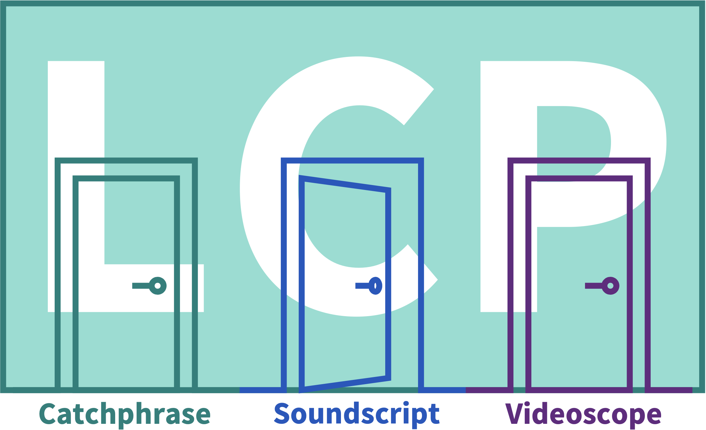

# LiRI Corpus Platform (LCP)

The LiRI Corpus Platform (LCP) is a cloud-based software system for handling and querying corpora of different kinds. Data in LCP are accessible via three individual interfaces: Based on the modality of the corpus (text, audio, audiovisual/video) and the desired analysis, the user decides on which interface fits their needs best. 

## Functionalities

  * allows definition of **complex queries**
  * users can import their **own corpora**
  * corpora is **automatically indexed** for faster search and retrieval
  * **modular system**: supports mono- or multilingual and mono- or multimodal data
  * comes with a dedicated **DQD** (Descriptive Query Definition) language

## Applications

LCP software system consists of several different applications, each allowing the querying and visualisation of different kind of corpora:

  * **[catchphrase](catchphrase.md)** - interface for querying textual corpora
  * **[soundscript](soundscript.md)** - interface for querying audio corpora
  * **[videoscope](videoscope.md)** - interface for querying multimodal corpora

By the end of 2024, digital editions will also be implemented and added to LCP system.

## Links

  * [DQD](dqd.md)
  * [Corpora in LCP](corpora_in_lcp.md)
  * [Corpus management](corpus_management.md)
  * [Querying](querying.md)
  * [Importing](importing.md)
