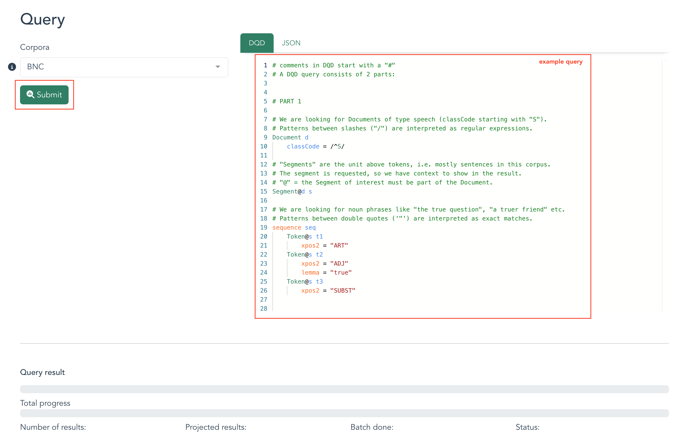
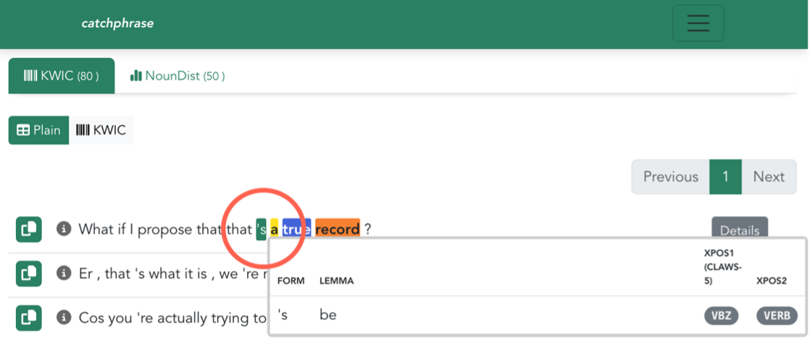

# LiRI Corpus Platform (LCP)

[LCP](https://www.liri.uzh.ch/en/services/LiRI-Corpus-Platform-LCP.html) is a cloud-based software system for handling and querying corpora of different kinds. Data in LCP are accessible via three individual web-app interfaces: based on the modality of the corpus (text, audio, audiovisual/video) and the desired analysis, the user can decide which interface best facilitates exploration of the corpus data.

LCP is being developed and maintained by a team at [LiRI](https://www.liri.uzh.ch/en.html), the Linguistic Research Infrastructure at UZH.

 <!-- Doesnt work, I wanted to center it, but it's not that important -->
  

**1. [Catchphrase](catchphrase.md) is optimized for working with text corpora:** use it when you are working with mono- or multilingual text corpora of any size. You can also use it when you need a faster search of your audiovisual collections by bypassing the retrieval of multimedia files.

**2. [Soundscript](soundscript.md) is optimized for working with audio corpora:** use it for speech corpora that include audio recordings, transcriptions, and any other annotations on the textual or media stream. Results will output text and sound recordings. You can use it for video collections, to output results reduced to audio only.

**3. [Videoscope](videoscope.md) is optimized for working with audiovisual/video corpora:** use it for viewing and querying audiovisual corpora based on video, that can include annotations on the media stream or text. The interface includes a video player and a timeline annotation preview. Querying results will output multimodal results and you can use them to navigate to the video recording.

## Common functionality

All graphical interfaces are powered by the same underlying backend, comprised of an asychronous Python web server, a PostgreSQL database, and a Redis instance for result caching. This backend includes a purpose-built query language that can be used to locate complex patterns in stored corpora.

Users can [query](querying.md) corpora directly from their browser and [import their own corpora](importing.md) using a command-line interface. Currently, the following corpora are publicly available in LCP:

- [British National Corpus (BNC)](http://www.natcorp.ox.ac.uk/) – text corpus
- [Text+Berg-Korpus - Alpine Journal](http://textberg.ch/site/de/willkommen/) – text corpus
- [corpus Oral de Français de Suisse Romande (OFROM)](https://ofrom.unine.ch/) - speech corpus

## First steps

Upon accessing LCP via [https://lcp.linguistik.uzh.ch](https://lcp.linguistik.uzh.ch/)  you can browse the publicly available corpora.  This screenshot shows the current selection, though more corpora will be made available over time. 

The corpora are shaded according to their modality/modalities. Green shading, for example, tells you that those are text corpora, and therefore can be queried via the *Catchphrase* interface. Accordingly, the OFROM corpus is shaded in blue. Alternatively, hovering over the bottom right corner of a corpus lets you know which application is available.

Navigating directly to any of the three interfaces at the top, e.g., on the blue *Soundscript* button, will filter the corpora to just those that are best navigated by the *Soundscript* interface. 

Clicking on one of the provided corpora reveals corpus details, including the word count, metadata and queryable annotations. Please note that the available metadata differs among the various datasets. See more information on the corpus structure on [Corpora in LCP](corpora_in_lcp.md). 

#### Login: edu-ID

While browsing the corpora can be done without it, any further action requires the user to log in. You will be prompted to do so when trying to access one of the corpora (clicking on one of the available interfaces as shown in the top left) or by navigating to the login option on the top right. You will be asked to login using your SWITCH edu-ID or institutional access. If you cannot find your institution in any of the provided options, please create e new SWITCH-edu-login. You can do so [here](https://eduid.ch/registration). 

#### Querying corpora

LCP uses a dedicated query language called [DQD](dqd.md). LCP provides example queries for each corpus, with comments guiding the user through their first query. As you are getting to know the platform and query language, you are invited to play around with the existing queries and see how the results change. Once you have written a valid query, click *Submit* to run the query.

 <!-- Doesnt work, I wanted to center it, but it's not that important -->
  

Once results begin to appear, you can hover over them to reveal more information about the query matches, such as lemma forms and part-of-speech tags. You can read more on the visualization of results [here](results.md). 

 <!-- Doesnt work, I wanted to center it, but it's not that important -->
  

Note that in the example above, the user has built a query that outputs a KWIC and NounDist; both are variables set by the user. To learn more about query construction, see the [*Querying* section](querying.md). 

#### Beta-testing

LCP is currently in beta testing. The platform is free to use during this period, and we encourage users to provide feedback regarding discovered bugs or desired features via [lcp@linguistik.uzh.ch](mailto:lcp@linguistik.uzh.ch).

#### Further reading

* [Query writing](querying.md)
* [The DQD query language in detail](dqd.md)
* [LCP's Data Model](model.md)
* [How corpora are modelled in LCP](corpora_in_lcp.md)
* [importing your own corpora](importing.md)
* [Corpus management and sharing](corpus_management.md)

