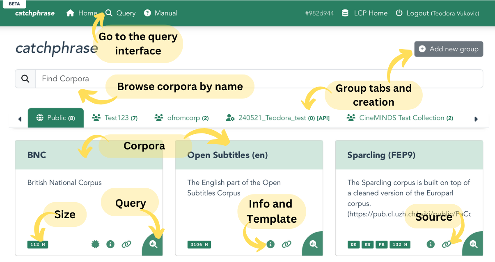
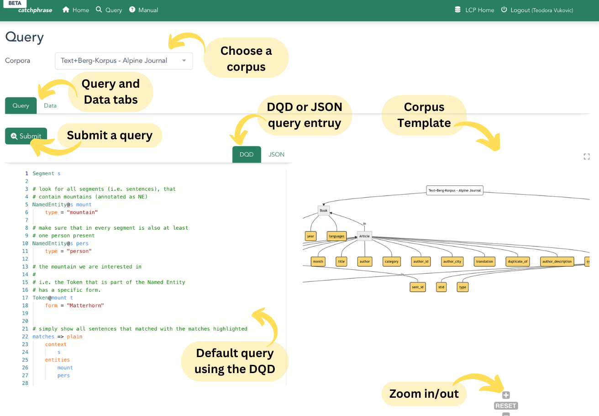
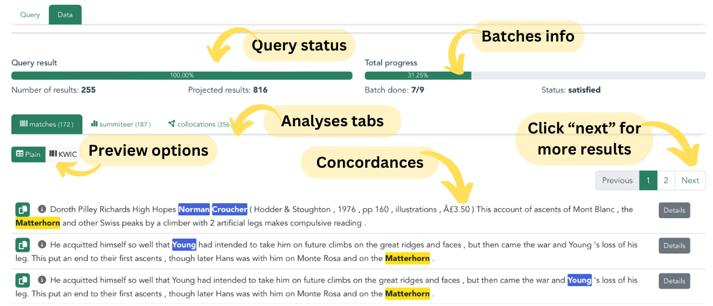

# *Catchphrase*

The Catchphrase interface is optimized for querying, analyzing and visualizing textual data. If you work with text corpora or focus on the textual aspects of a multimodal corpus, Catchphrase is most efficient. 

## The landing page 
The langing page of Catchphrase is designed in the same way as the main LCP page, but allows access only to the textual part of the corpus. In case of multimodal corpora, the annotations will be included, but not the media.

 <!-- Doesnt work, I wanted to center it, but it's not that important -->
  

## Query tab

The Query tab is designed the same way across all interfaces. It contains the query entry field and the corpus template preview. Each corpus typically comes with a default DQD query as assistance. Move and magnify the template visualization for a better overview.

 <!-- Doesnt work, I wanted to center it, but it's not that important -->
  

For more information on querying see the [DQD](dqd.md) page.

## Results / Data tab

Once the query has been submitted, results will show in the "Data" tab.

 <!-- Doesnt work, I wanted to center it, but it's not that important -->
  

### Analyses
In the analyses tabs, you can sort the results based on column values. Variables shown here depend on the definition in the DQD query.

 <!-- Doesnt work, I wanted to center it, but it's not that important -->
  

Pro tip, if you sort by one column and then press another column header while holding the Shift button, you can sort based on two columns.

### Collocations

Here you can see the statistics regarding collocations for the chosen settings from the DQD query.

 <!-- Doesnt work, I wanted to center it, but it's not that important -->
  

