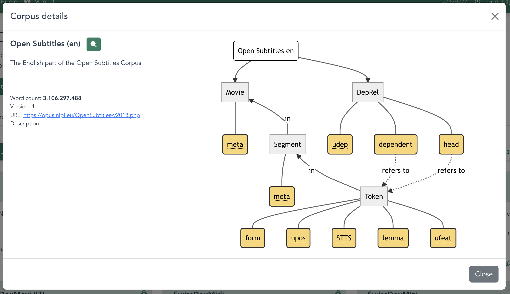

# Corpora in LCP

In LCP corpora is modeled as connected layers: at least three layers must represent (i) ordered units, (ii) ordered collections of said units, and (iii) unordered collections of the latter. Prototypically, these three units correspond to words/tokens, sentences/utterances, and texts/documents.

Layers can have any number of attributes for annotation purposes, and corpus authors can define additional layers to model further embedding or dependency relations. This means that the smallest layer (i) may contain not just raw tokens, but lemma forms, POS tags, dependency grammar functions, morphological information, as well as arbitrary, user-defined features or metadata.

The diagram in the figure below shows the structure of a corpus created from the *Open Subtitles* corpus, which currently contains approximately ten billion words. Layer (i) represents individual tokens, each of which has a form, lemma and part-of-speech tag. Groups of these tokens comprise sentences (layer ii) which are themselves contained in movies (layer iii); a parallel layer models the dependency relations between tokens, allowing complex lexicogrammatical queries.

A [simple command-line interface](lcp_cli.md) allows users to submit corpora to LCP as standard TSV tables along with JSON metadata (for their either private or public use). This data is converted and stored in a high-performance PostgreSQL database, making it possible to quickly query and obtain example sentences and statistical results from corpora containing billions of words.
