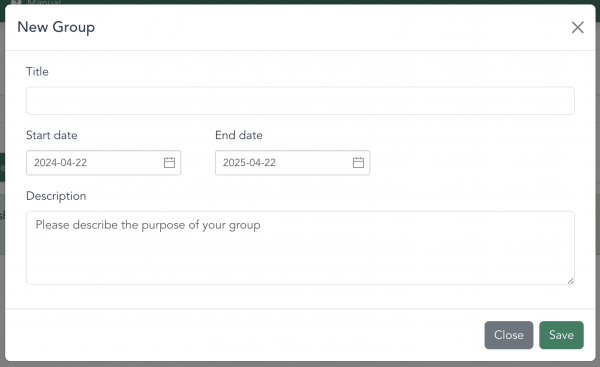
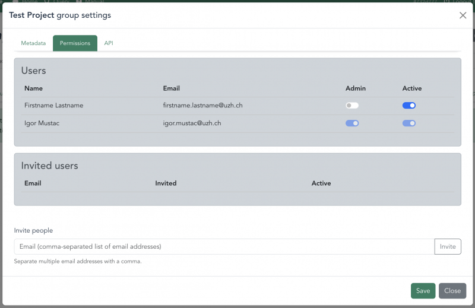

# Corpus management

The LCP engine contains a user management system which allows you to create and manage *corpora*, and define who can access corpora through the use of *groups*. Once you have [uploaded corpora to the system](importing.html), you can create new groups and invite users to them. A member of a group can view all corpora contained within that group.

This sytem of corpora and groups is common to all LCP interfaces,

## Groups

When creating a new group, you need to specify the group's name, the start and end dates of the project duration, and describe the purpose of the group.

After creating the group, you can manage permissions and invite people via email to join. Simply enter the email addresses separated by commas to invite individuals. After the user accepts your invitation, they will be listed under the "Users" section. From there, you can assign them admin rights or manage their active status by enabling or disabling their account. This feature empowers you to control access and collaborate effectively with team members.

## Corpora

[!IMPORTANT]
How to see corpora, how to modify corpora, how to add corpora, who can see this (add screenshots that show where you can modify this)
