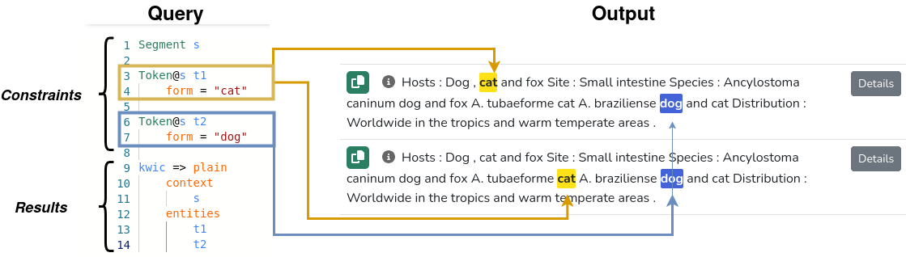
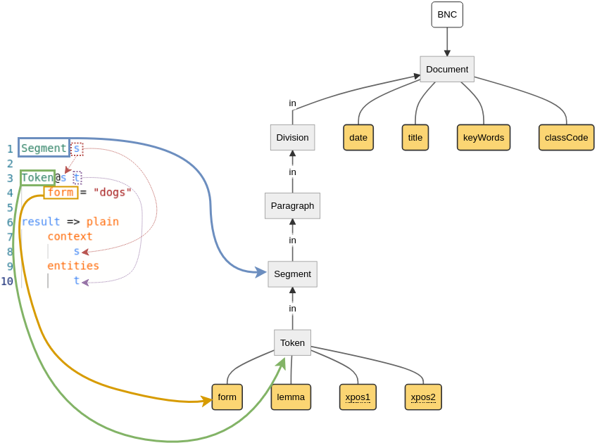

# The DQD Query Language

> For a list of keywords used in DQD, see [DQD keywords](keywords.md)

## Introduction

LCP's query language _DQD_ (**D**escriptive **Q**uery **D**efinition) lets you look for matches based on a set of constraints and output the results in various formats.

The picture above illustrates a simple query looking for co-occurrences of "cat" and "dog" within the same sentence (the _Constraints_ part of the query) and asking to output them as a plain list of matches (the _Results_ part of the query).

( ! ) 
As visible in the picutre, you can have <strong>multiple matches for one sentence</strong>. DQD follows the idea of 
<!-- <a href="https://en.wikipedia.org/wiki/Entity%E2%80%93relationship_model" target="_blank"> -->
<em>Entity-Relationship models</em>: it defines sets of entities by listing logical constraints on their properties and on their relations to one another. <strong>Any combination of entities matching the constraints constitutes a hit</strong>, which explains the results above.

DQD also includes quantifiers, which can be used to write constraints that do not add new entities to the constellation.

## Getting started

The picture below relates a simple query on [the BNC corpus](https://catchphrase.linguistik.uzh.ch/query/2/BNC) (on the left, "look for all occurrences of _dogs_") to its structure (on the right).

### Corpus-specific queries

The first remark about DQD is that **it adapts to the specificities of each corpus**. The terms `Segment`, `Token` and `form` in the query all occur in the diagram; another corpus could use `Word` instead of `Token`, in which case the DQD query would use that term instead.

The same is true of **all entities and attributes in the corpus**: in the BNC corpus, the part-of-speech of each token was labeled according to two different conventions, hence each token comes with two attributes named `xpos1` and `xpos2`. Queries can define constraints on either attribute (as in, e.g., `xpos2 = "VERB"`)

For this reason, it is important to know the structure of a corpus when writing a DQD query, which is why LCP displays a diagram along with the query editor.

( ! ) 
To learn more about <strong>>corpus diagram</strong>, you can read the page <a href="corpora_in_lcp.html">Corpora in LCP</a>.

### Entities

Entities are instantiated by providing the name of their [annotation layer](model.md#layers), followed by a (unique) label, which can be used to reference the entity later on. The simple line **`Segment s` instantiates an entity labeled `s` on the annotation layer `Segment`**.

The query above declares a second entity, labeled `t`, on the annotation layer named `Token`. The operator **[`@`](at.md) requires that it overlap character-wise** with another entity, in this case the segment labeled `s`. As visible in the diagram, each token is fully contained _in_ a segment, so overlapping here means being _part of_ a segment.

( ! ) 
The presence of the <code>@</code> operator is important: without it, you would be looking for <strong>any possible combination</strong> of a segment and a token "dogs" in the corpus. So even if "dogs" appeared only once in a single segment across the entire corpus, if it contained a total of 1000 segments, you would end up with 1000 matches, because the query would define no relation constraint between the segment and the token. If "dogs" appeared twice, you would have 2000 matches, and so on, which quickly explodes and can lead to significant querying times.

### Constraints

Simple constraints usually use the format `left operator right`. When the constraint appears in the scope of an entity (as signaled by indentation), `left` and `right` can be the name of an attribute of that entity.

The constraint in the example above respects this schema: `left` is `form`, `operator` is `=`, and `right` is `"dogs"`. LCP allows corpus curators to define arbitrary attributes for each layer, but `form` is mandatory at the token level. This constraint states that we are looking for tokens whose surface form must be "dogs". 

Annotation layers can come with any number of attributes. For example, the `Document` layer in this corpus has three attributes named `date`, `title`, `keyWords` and `classCode`. It is standard for tokens to also define an attribute named `lemma`. Had we written the constraint `lemma = "dog"` instead, we would have matched token occurrences whose surface form could be either "dog" or "dogs".

( ! ) 
Attributes can have different types; in this illustration, both <code>form</code> and <code>lemma</code> are assumed to be strings. Accordingly, we surround the test value with double quotes; DQD does <em>not</em> accept strings surrounded by single quotes. You can also use forward slashes <code>/</code> to define unanchored <strong>regular expressions</strong> (use <code>^</code> and <code>$</code> for anchoring purposes).

## Sequences

To look for a sequence of tokens rather than isolated tokens, one can use the keyword [`sequence`](sequence.md).

## Sets

By default, each entity produce one match for each occurrence in the corpus. For example, if one sentence contains three occurrences of "dogs", the results will report three distinct hits for that sentence. To prevent that behavior, one can use the keyword [`set`](set.md).

## Results

DQD queries come with a constraint part, and a results part. There are three types of results:

 1. [`plain`](results.md#plain)
 2. [`analysis`](results.md#analysis)
 3. [`collocation`](results.md#collocation)