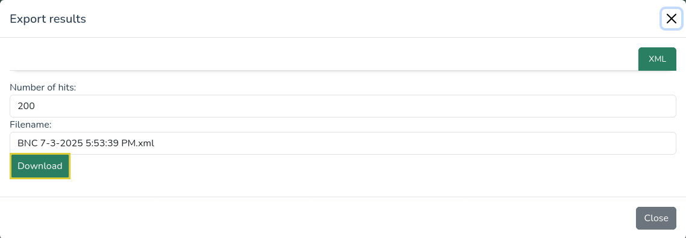

# Exporting

## LCP Interface

Query results can be saved locally using the Export function.

<p>
  
</p>

Clicking the "Export" button prompts a dialog window with the option to download the results.

<p>
  
</p>

Clicking the "Download" button will initiate the export process. Hover the download icon in the top bar to get the file once it is ready.

<p>
  
</p>

## Results file

As of July 2025, LCP exports results to XML files with the following structure:

```xml
<results>
  <corpus></corpus>
  <query></query>
  <stats></stats>
  <plain></plain>
</results>
```

 - The `corpus` node (always present) contains metadata about the corpus, such as its name, its authors, etc.
 - The `query` node (always present) contains information about the query: when it was processed, the requested number of hits, etc. The `json` sub-node contains the json translation of the query.
 - `stats` will be present if the query includes at least one `analysis` or `collocation` set of results. Each set will live under a dedicated node whose `name` attribute is defined in the query.
 - `plain` will be present if the query includes at least one `plain` set of results. Its children nodes are structured as such:
   - each node whose tag starts with an **upper-case** character corresponds to an **entity** from the corpus (e.g. `Document` or `Token`); simple attributes of the entity (i.e. which do not contain sub-attributes) are reported as direct attributes of the node
   - the context-level nodes (e.g. `Segment`) contain a node **`hits`** that references the **IDs of the matching entities**. The `hits` node contains one `hit` node per `plain` set, named as defined in the query.
   - any other node whose tag starts with a **lower-case character** (e.g. `misc`) is an **attribute** of the parent entity which contains **sub-attributes**.
   - **only entities that contain a match** are included in the file
   - the nodes are nested according to the structure of the corpus, and ordered along their `char_range` value (i.e. their character anchor)

### Example of a `plain` sample

```xml
<Interview id="307" char_range="[3968023,3981532)" frame_range="[6603764,6620348)">
  <meta end="664.33" name="unine15a61m" start="0.0" filename="unine15a61m.tei"/>
  <media audio="unine15a61m.mp3"/>
  <Utterance id="498dbec7-8ea0-4f21-bce6-dce2655a2e35" char_range="[3970952,3970958)" frame_range="[6607272,6607290)">
    <meta end="141.04" text="et euh" start="140.32" sent_id="a3155" speaker="SPK1"/>
    <agent id="unine15-043" nom="NR" pays="Suisse" role="Témoin" sexe="F" metier="Étudiante" prenom="NR" region="Berne" langage="Français L1" departement="Berne" nature_lien="NR" habite_depuis="1995" annee_naissance="1995" degre_proximite="NR" domicile_actuel="Saint-Imier" statut_familial="Célibataire" domicile_jeunesse="Saint-Imier" niveau_socioeducatif="Formation supérieure"/>
    <hits>
      <hit name="results">
        <sequence name="seq" refers_to="[819772, 819773]" />
      </hit>
    </hits>
    <Token id="819772" lemma="et" xpos="CON">et<misc key="MINg" conjunction="CON"/></Token>
    <Token id="819773" lemma="euh" xpos="ITJ">euh<misc key="MAJ" filler="FIL"/></Token>
  </Utterance>
</Interview>
```