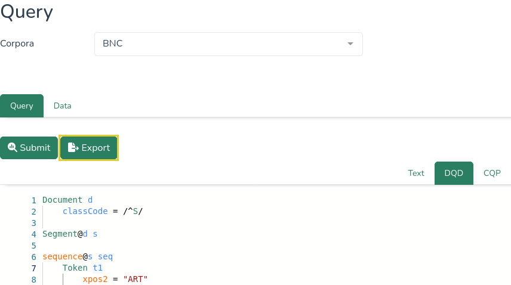

# Exporting

Query results can be saved locally using the Export function.

 <!-- Doesnt work, I wanted to center it, but it's not that important -->
  

Clicking the Export button prompts a dialog window with the option to download the results. Depending on the settings in the query, the output may contain several parts, including the sentences and the quantitative analyses.

 <!-- Doesnt work, I wanted to center it, but it's not that important -->
  

Note that only the results included in the current batches will be saved. In order to save all results, query all the batches.

