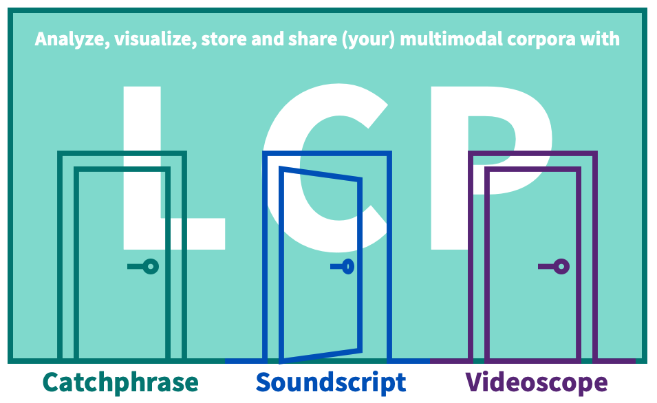

# First Steps
[LCP](https://www.liri.uzh.ch/en/services/LiRI-Corpus-Platform-LCP.html) is a cloud-based software system for handling and querying corpora of different kinds. Data in LCP are accessible via three individual interfaces: Based on the modality of the corpus (text, audio, audiovisual/video) and the desired analysis, the user decides on which interface fits their needs best. LCP is being developed and maintained by a team at [LiRI](https://www.liri.uzh.ch/en.html), the Linguistic Research Infrastructure at UZH. 

 <!-- Doesnt work, I wanted to center it, but it's not that important -->
  

**1. [Catchphrase](catchphrase.md) is optimized for working with text corpora:** Use it when you are working with mono- or multilingual text corpora of any size. You can also use it when you need a faster search of your audiovisual collections by bypassing the retrieval of multimedia files.

**2. [Soundscript](soundscript.md) is optimized for working with audio corpora:** Use it for speech corpora that include audio recordings, transcriptions, and any other annotations on the textual or media stream. Results will output text and sound recordings. You can use it for video collections, to output results reduced to audio only.

**3. [Videoscope](videoscope.md) is optimized for working with audiovisual/video corpora:** Use it for viewing and querying audiovisual corpora based on video, that can include annotations on the media stream or text. The interface includes a video player and a timeline annotation preview. Querying results will output multimodal results and you can use them to navigate to the video recording.

Importantly, all interfaces are powered by LCP and use the same unified query language, which has specific functions for different datatypes. The advantage of the separation into separate access points is their customization optimized to specific corpus modalities. Read more on the query language [DQD](dqd.md) and how to [build queries here](querying.md). By the end of 2024, digital editions will also be implemented and added to LCP system. <!--This last sentence was written in the earlier version of README.md--> 

Users can query corpora directly from their browser and upload their own corpora using a command-line interface (for more information, please check [Importing](importing.md)). Currently, the following corpora are publicly available in LCP: 

- [British National Corpus (BNC)](http://www.natcorp.ox.ac.uk/) – text corpus 
- [Text+Berg-Korpus - Alpine Journal](http://textberg.ch/site/de/willkommen/) – text corpus 
- [corpus Oral de Français de Suisse Romande (OFROM)](https://ofrom.unine.ch/) - speech corpus 

#### Beta Testing 
LCP is currently in beta testing. The platform is free to use during this period as we gather input to improve it.
Feel free to report any feedback or bugs to ((add email address here)).

#### Further Links
  * Further description of the [DQD query language](dqd.md)
  * Detailed tutorial on [Querying](querying.md)
  * [How corpora are modelled in LCP](corpora_in_lcp.md)
  * How to store and share your corpora: [Corpus management](corpus_management.md)
  * How to [import your own corpora](importing.md)

#### LCP Functionalities <!-- Keep this? -->

  * allows definition of **complex queries**
  * users can import their **own corpora**
  * corpora are **automatically indexed** for faster search and retrieval
  * **modular system**: supports mono- or multilingual and mono- or multimodal data
  * comes with a dedicated **DQD** (Descriptive Query Definition) language