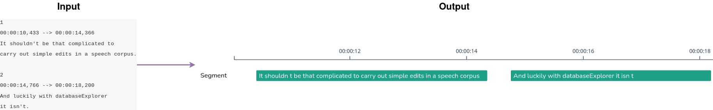
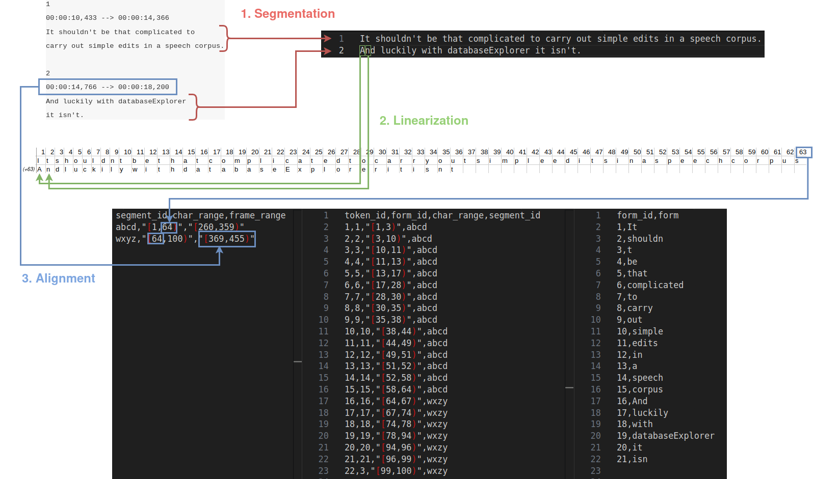

# Part 1: Conceptual overview

  

The image above show the first lines of a transcript file on the left (our input) and what we want to obtain in _videoScope_ (our output). To do so, we need to go through 3 main steps:

 - **Segmentation**
 - **Linearization**
 - **Alignment**

  

## Segmentation

In LCP, the source text needs to be _segmented_: segments will be the space within which end-users will look for sequences of words. Typically, **segments will correspond to sentences**.

SRT files often have one sentence per numbered block, as in the image above (one sentence in the two text lines of block 1, another sentence in the two text lines of block 2).


**Sentences and blocks don't always align**: some sentences will span multiple blocks in an SRT file, and some blocks will contain multiple sentences. This will be something to keep in mind when processing the data


In addition, each segment is further divided into _tokens_. **Tokens typically correspond to words**, which roughly correspond to space-separated bits of text in the input.


**Using just space characters as token delimiters is too simplistic**: as visible in this example, written English has cases like `shouldn't`, which arguably corresponds to two tokens (`should` and `not`). For the sake of simplicity, we will use `'` as a delimiter and accordingly map `shouldn't` to two tokens with the forms `shouldn` and `t`.


## Linearization

LCP flattens the source text along an axis so that **each character has its own, uniquely numbered index**. This makes for more performant queries. It also allows for annotations that are not bound by the segment and token boundaries: using character indices, one could create an annotation that spans the last three characters of `corpus` and the two first character of `And` (i.e. characters 61 through 65).

## Alignment

Alignment is the process of reporting **where the units previously defined (tokens, segments) fall along the axes** in the corpus.


In this example, the first segment spans characters 1 through 64 (excluded) and the second segment spans characters 64 through 100 (excluded). The first token (form `It`) spans characters 1 through 3 (exclued) and the last token (form `t`) spans character 99 through 100 (excluded).


Because we are working with video transcripts, **units can also be aligned along a time axis**. SRT files don't give us a good estime for timecode for words so we will not align tokens along the time axis (although LCP makes this possible) but we can use the blocks' timecodes to align the segments.


In this case, the `frame_range` column reports pairs of integers, which correspond to the time codes multiplied by 25 (LCP uses a convention of 25 frames per second for time-alignment).



**Rembember that sentences and blocks don't always align** so using the blocks' time codes is only an _approximation_ of when sentences start and end.


## Additional remarks

As visible in the image above, LCP does not directly store tokens along with their form: instead, **tokens are associated with a form index, which are themselves associated with strings of text**.


For example, token 3 (from the first segment) and token 22 (from the second segment) share the same index (`3`) because they both have the form `t`.


In the next part, we will first generate the CSV files illustrated above (in order: `segment.csv`, `token.csv` and `token_form.csv`) in addition to one more required CSV file for the tokens (`token_lemma.csv`, a copy of `token_form.csv`) and one CSV file for the documents (the videos).

Then we will add annotations to the data: (1) we will report which tokens were identified using `'` as a delimiter, and (2) we will associate each segment with its original text (including the delimiter characters) for display purposes. As a result, (1) `token.csv` will have additional columns, and (2) we will generate a file named `segment_original.csv` (and add a corresponding column to `segment.csv`).