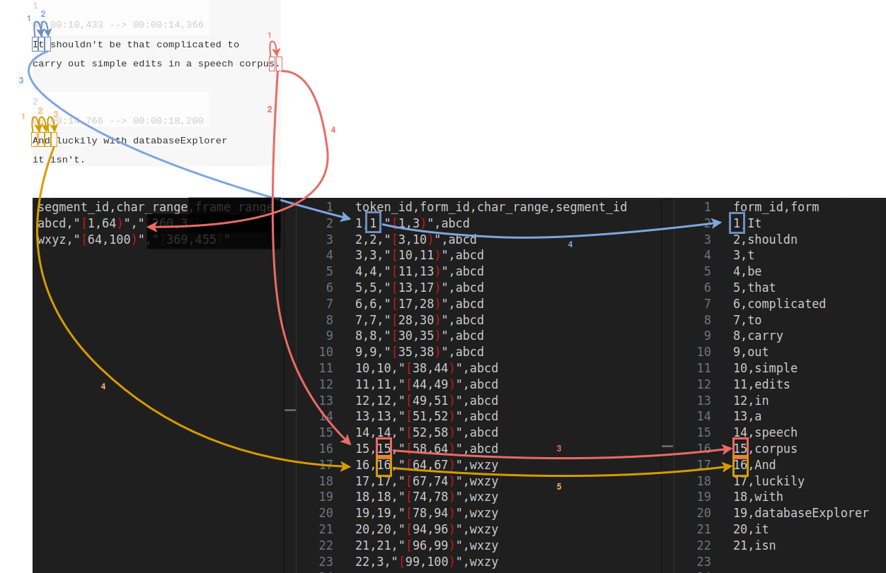

# Part 2: Processing the data

## No time alignment

For the sake of illustration, we will start by generating non-time-aligned files. We will write a script that increments a counter for each character in the transcript, such that:

 - if the character is **not** among `,`, ` `, `.`, `?` or `!`, it goes into a string buffer and the counter is incremented by 1
 - if the character **is** `,` or ` ` (<span style="color:lightblue">**blue**</span> and <span style="color:orange">**orange**</span> lines below): we have a full token in the buffer, we add a line to `token.csv` along with its span on the character axis and a form ID; we also add a line to `token_form.csv` that reports the form ID + form string association
 - if the character is `.`, `?` or `!` (<span style="color:red">**red**</span> lines below): we have reached the end of a sentence, we add a new line to `segment.csv` along with its span on the character axis
 - if the character is a linebreak at the start of a new line we ignore the next two line (block number and time stamps)


<p>
  
</p>

A python script that implements this logic (across two SRT files) can be found [here](https://github.com/liri-uzh/lcp_tutorial/blob/main/text_no_lemma/convert.py).

### Configuration file

Before we can upload our files, we need to create a configuration file to let LCP know how to handle the tables. The configuration file is a JSON file which reports some metadata information about the corpus (its name, its authors, etc.) the annotation layers present in the corpus and their attributes. The information is used not only to create entries in the database, but also to inform the engine about what data in the corpus can be queried, and how.

In our case, things are pretty simple, let us see what the configuration file needs to look like:

```json
{
    "meta": {
        "name": "Test Corpus",
        "author": "LCP tutorial",
        "date": "2025-03-26",
        "version": 1,
        "corpusDescription": "Test corpus from the tutorial"
    },
    "firstClass": {
        "document": "Document",
        "segment": "Segment",
        "token": "Token"
    },
    "layer": {
        "Document": {
            "layerType": "span",
            "contains": "Segment",
            "attributes": {}
        },
        "Segment": {
            "layerType": "span",
            "contains": "Token",
            "attributes": {}
        },
        "Token": {
            "layerType": "unit",
            "anchoring": {
                "stream": true,
                "time": false,
                "location": false
            },
            "attributes": {
                "form": {
                    "type": "text",
                    "nullable": false
                }
            }
        }
    }
}
```

The first key, `firstClass`, simply defines the names your corpus uses for the three basic annotation layers, as shown to the end-user, and in this case we use straightforward names.

Under `layer` should be reported one key for each annotation layer in the corpus. In this case, we work with a very basic corpus, so we only define the three basic annotation layers. Note that for the basic layers, the names need to match exactly the values defined in `firstClass` (i.e. the names start with an uppercase character, not a lowercase one). The names of the CSV files also need to match those names, although the filenames should use lowercase characters exclusively; this is also true of the column names (`document_id`, `segment_id`, `token_id`). For example, had we reported `"segment": "Sentence"` in `firstClass`, we would have used `"Sentence"` as key instead of `"Segment"` in `layer`, `sentence.csv` instead of `segment.csv` as a filename and the column's name would have been `sentence_id`.

The `Document` and `Segment` layers are straightforward: they are spans of segments and token units, respectively, and have no attributes exposed to the user (their IDs and character ranges exist for database-related purposes only and, as such, are not considered attributes here).

The `Token` layer is of type `"unit"` because it is parent to no further annotation layer. The token layer of any corpus must always define `anchoring`: it tells LCP whether the table has a `char_range` column (i.e. `stream` is set to `true`) and whether it has other types of ranges, for timestamps (`time` -- more about this later in this tutorial) or for XY coordinates (`location` -- not covered in this tutorial). Finally, `attributes` lists the attributes of the tokens, in this case only `form`. Note that the names reported in `attributes` need to match exactly the column names in the CSV files: token_form.csv, in addition to being named after the exact lowercase versions of the layer's name and the attribute's name, has a column named *exactly* `form` and another one named `form_id`, while token.csv also has a column named `form_id`. Attribute names should always use under_score casing and can never include uppercase characters. Like we said earlier, the `form` attribute is of type `text` because the possible values are numerous, and when LCP sees an attribute of type `text` on an annotation layer in the configuration file, it requires a lookup file named `{layer}_{attribute}.csv` in addition to `{layer}.csv`. Finally, the `form` attribute is set to `nullable`=`false` because we do not accept tokens with an empty form.

### One last step

In its current state, LCP also requires the token layer of all corpora to define a `lemma` attribute of type `text` besides `form`, otherwise import will crash. 


Take a moment to think of how you would modify the python script to add that attribute (re-using the same values as for `form`) and how you would update the configuration file to report that attribute.


An updated python script and an updated configuration file can be found [here](https://github.com/liri-uzh/lcp_tutorial/tree/main/text_with_lemma).

### Import

Run the python script, save the JSON configuration in a file named meta.json alongside your CSV files in your output folder. Install the `lcpcli` tool:

`pip install lcpcli`

Now visit [catchphrase](https://catchphrase.linguistik.uzh.ch) and create a new corpus collection, then open its setting by clicking the gear icon, click the "API" tab and create a new API key; write down the key and the secret.

Open a terminal and run the following command, replacing `$API_KEY` with the key you just got, `$API_SECRET` with the secret you just got and `$PROJECT` with the name of the collection you just created:

`lcpcli -c path/to/output/ -k $API_KEY -s $API_SECRET -p "$PROJECT" --live`

You should get a confirmation message, and your corpus should now be visible in your collection after you refresh the page!


### Adding annotations

For the sake of illustration, we will now add two pieces of annotation: we will report the original text of each segment (which will include the token-delimiter characters) and we will report whether each token was preceded by a single quote (we will name the attribute `shortened`)


Because each segment has a different original text, which is a relatively long string, we will store them in a lookup CSV file, just like we did for `form`. The `shortened` attribute, however, can take only two values (`yes` vs `no`) so those will be reported direclty in `token.csv`. The configuration file informs LCP of those parameters.


An updated python script and an updated configuration file can be found [here](https://github.com/liri-uzh/lcp_tutorial/blob/main/text_original_shortened).


### Time alignment and video

The corpus we prepared above is a text-only corpus: the token layer (and, by inheritence, the segment and document layers) are only aligned on the character axis and, correspondingly, their tables have a column named `char_range`. In this section, we will use the timestamps from the transcript files to add an anchor on a time axis, and we will associate each document with its video file.

Because the timestamps only give us (approximate) information about the segments, we will _not_ align the tokens on the time axis. The file `token.csv` will therefore remain unchanged; the files `segment.csv` and `document.csv`, however, will gain one additional column, named `frame_range`.

For each segment, we build its `frame_range` value as follows: we take the start-point of the block where the segment starts and the end-point of the block where the segment ends, and we multiply each by 25 (LCP uses a convention of 25 frames per second). For the documents, `frame_range` will simply correspond to the lowest start-point of the contained segments + the highest end-point of the contained segments.

Finally, `document.csv` needs an additional column `name`, which will report the name to be used in _videoScope_ for browsing purposes, and one column named `media`, which will report which video file to use for playback in _videoScope_; the `media` column reports stringified JSON key-value objects with a key (here, `video`) mapping to the filename of the media file correspondig to the document.

An updated python script and an updated configuration file can be found [here](https://github.com/liri-uzh/lcp_tutorial/tree/main/video).


The configuration file only requires minimal edits. First, because this is now a multimedia corpus, we need to report a `mediaSlots` key-value object in `meta`. Each key in `mediaSlots` needs to have a correspondingly named key (in this case, `video`) in the object from the `media` column of the document's table, which will report the filename to display in LCP for that document. LCP allows assocations of more than just one media file per document, but we will keeps things simple here.

Finally, we now report explicit `anchoring` settings for the segment and document layers (with `time` set to `true`), because they no longer correspond to the `anchoring` settings for the token layer.


Make sure you place the mp4 files in a `media` subfolder in the output folder. The upload command remains the same as before, but the process will include one extra last step to upload the media files, which can take some time depending on your connection.

When you visit your corpus on _videoScope_, you will notice a video player and a timeline. By default, the timeline displays the segment attributes. Because this corpus has a single segment attribute, the timeline reports the `original` text, aligned according to the `frame_range` value of the corresponding segment.