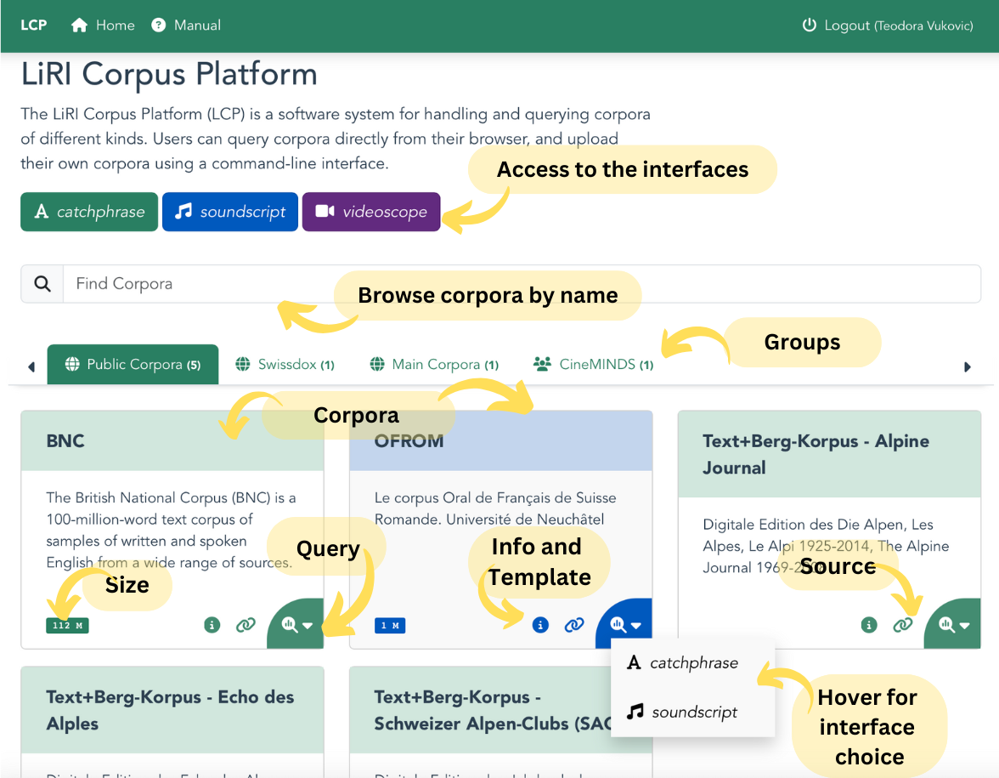

# *LCP Landing Page*

The langing page of LCP is a gateway to all the corpora and interfaces. The default modality of the corpus is shown by the color of the tile: teal for text/catchphrase, blue for audio/soundscript, purple for video/videoscope.

The default interface will open by pressing on the query button. However, by hovering over the query button the user can choose an alternative interface to view or query the corpus, e.g., open video corpora in catchphrase witout the media files.

 <!-- Doesnt work, I wanted to center it, but it's not that important -->
  

The design of the page is applied across all applications. It changes depending on the interface, e.g., VideoScope will show only video corpora.
