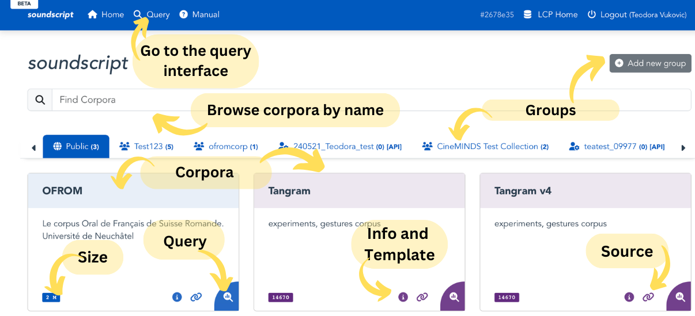
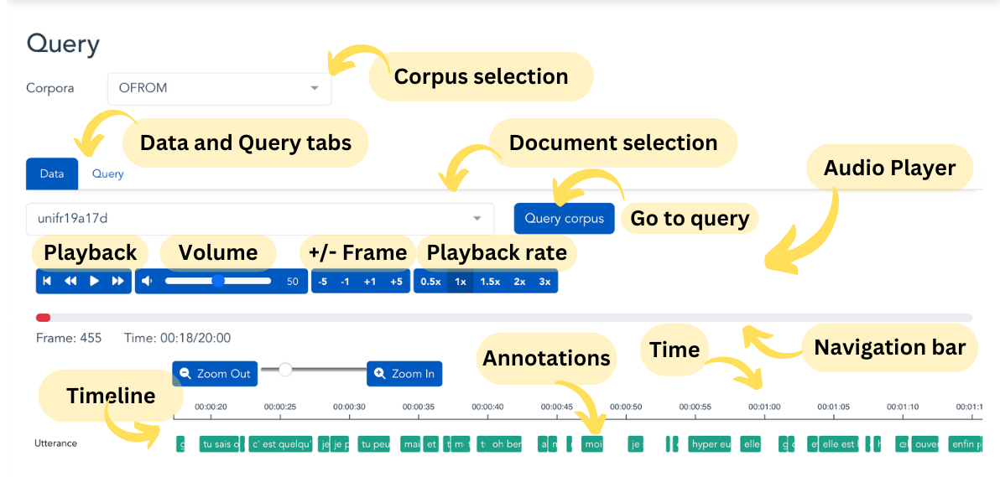
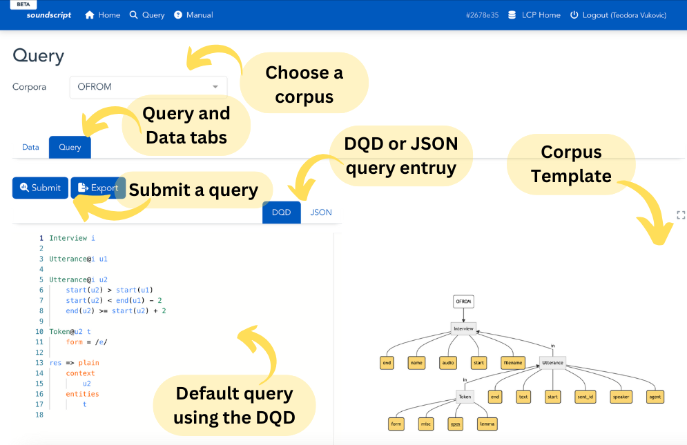
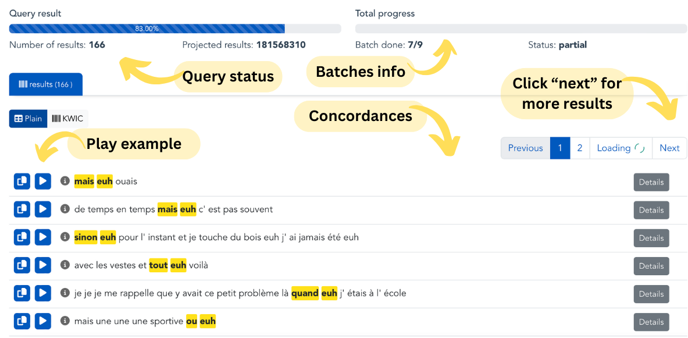
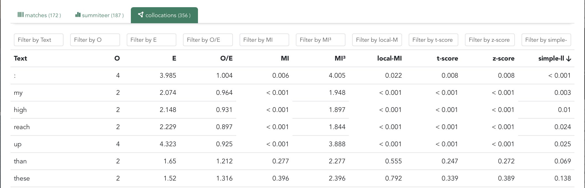

# *Soundscript*

The Soundscript interface is optimized for querying, analyzing and visualizing audio data. If you work with, e.g., speech corpora or want to focus on the audio aspects of a multimodal corpus, Soundscript is most efficient. 

## The landing page 
The langing page of Soundscript is designed in the same way as the main LCP page, but allows access only to the audio corpora the corpus. In case of video corpora, sound and annotations will be included, but not the video. Text corpora are not shown here.

 <!-- Doesnt work, I wanted to center it, but it's not that important -->
  

## Data tab

In Soundscript (and in Videoscope), the data tab is shown first, to allow for browsing though the media and annotations before querying.

### Media Player and timeline

The meida player shows the audio recording for a cosen document. 

The timeline previews time-aligned transcripts and other annotations in layers. You can click and drag the timeline left and right to view annotations. if you hover over annotation tiles, more information will show associated to that element.

 <!-- Doesnt work, I wanted to center it, but it's not that important -->
  

## Query tab

The Query tab is designed the same way across all interfaces. It contains the query entry field and the corpus template preview. Each corpus typically comes with a default DQD query as assistance. Move and magnify the template visualization for a better overview.

 <!-- Doesnt work, I wanted to center it, but it's not that important -->
  

For more information on querying see the [DQD](dqd.md) page.

## Results / Data tab

Once the query has been submitted, results will automatically show in the "Data" tab, below the player. Pressing the Play button will navigate the media player to the place in the document for a chosen example.

 <!-- Doesnt work, I wanted to center it, but it's not that important -->
  

### Analyses
In the analyses tabs, you can sort the results based on column values. Variables shown here depend on the definition in the DQD query.

 <!-- Doesnt work, I wanted to center it, but it's not that important -->
  

Pro tip, if you sort by one column and then press another column header while holding the Shift button, you can sort based on two columns.

### Collocations

Here you can see the statistics regarding collocations for the chosen settings from the DQD query.

 <!-- Doesnt work, I wanted to center it, but it's not that important -->
  

