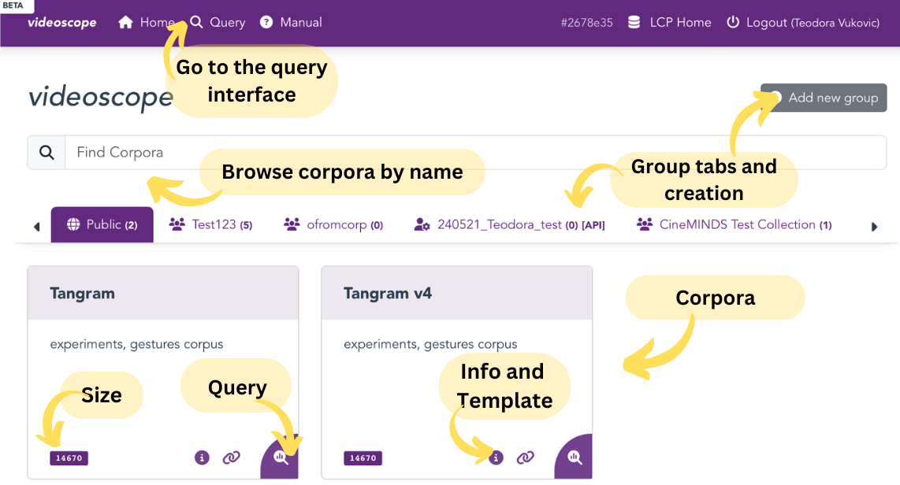
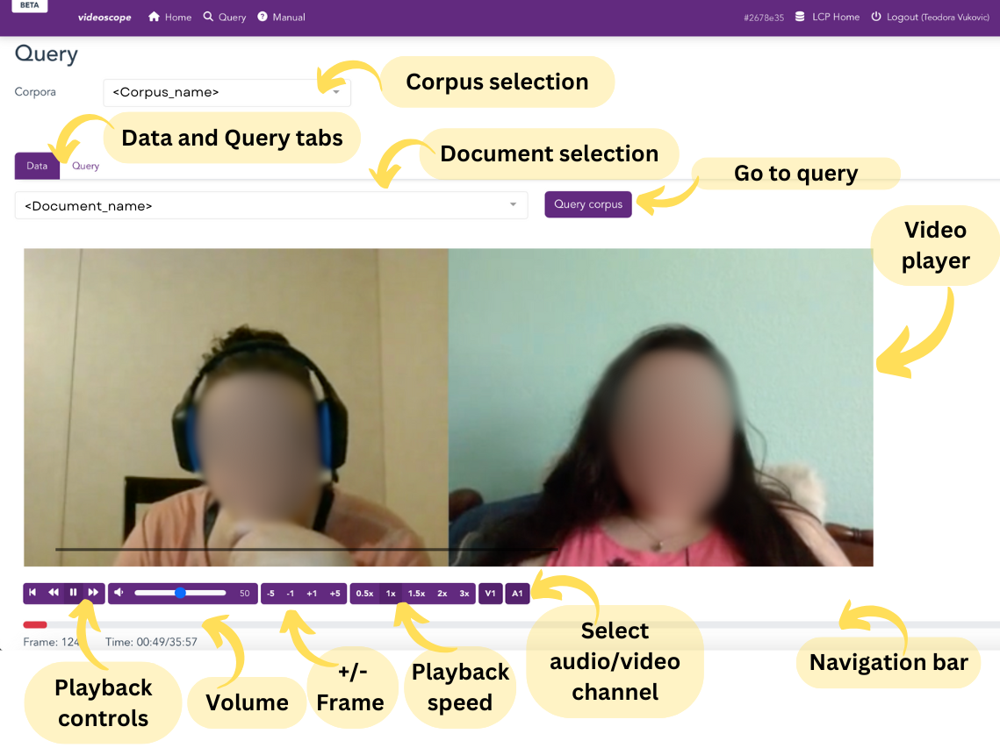
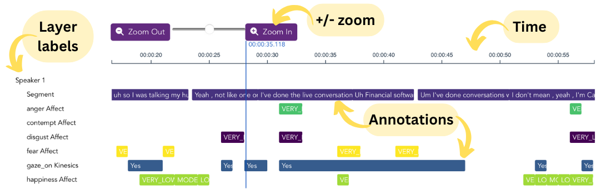
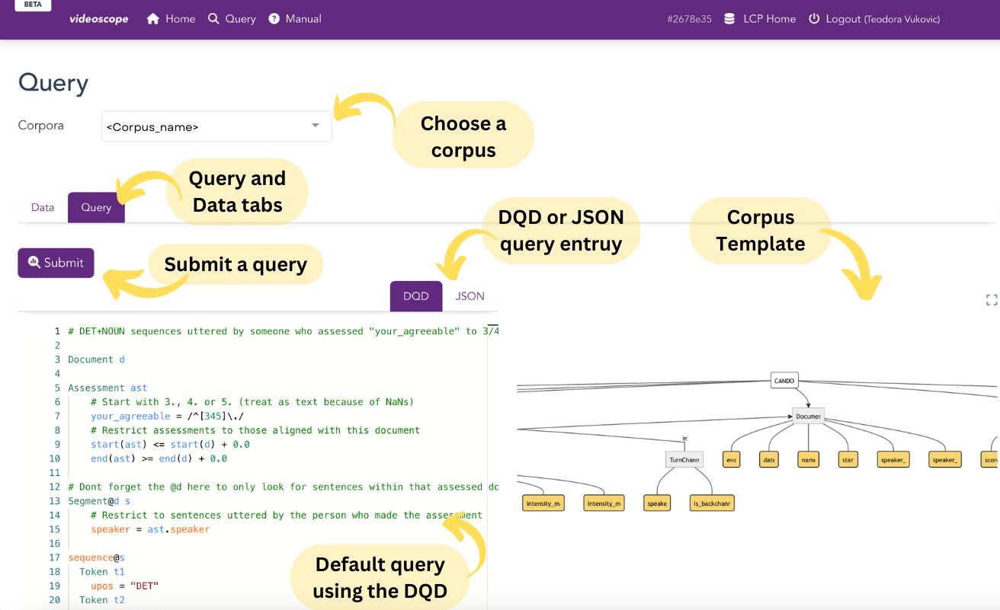
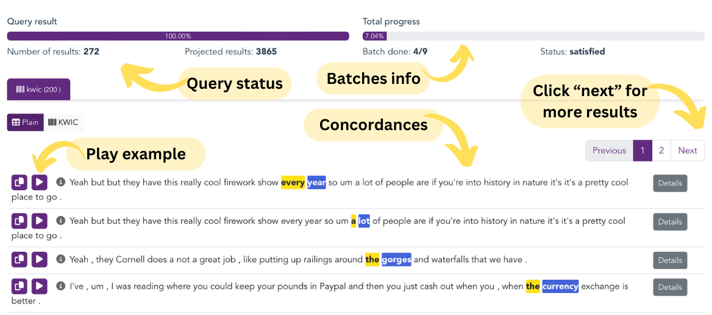

# *Videoscope*

The Soundscript interface is optimized for querying, analyzing and visualizing audio data. If you work with, e.g., speech corpora or want to focus on the audio aspects of a multimodal corpus, Soundscript is most efficient. 

## Landing page 
The langing page of Videoscope is designed in the same way as the main LCP page, but allows access only to the video corpora. Audio and text corpora are not shown here.

 <!-- Doesnt work, I wanted to center it, but it's not that important -->
  

## Data tab

In Videoscope (and in Soundscript), the data tab is shown first, to allow for browsing though the media and annotations before querying.

### Media Player

In Videoscope, the meida player can show up to four video and audio channels for a single document. 

 <!-- Doesnt work, I wanted to center it, but it's not that important -->
  

### Timeline

The timeline previews time-aligned transcripts and other annotations in layers. You can click and drag the timeline left and right to view annotations. if you hover over annotation tiles, more information will show associated to that element.

 <!-- Doesnt work, I wanted to center it, but it's not that important -->
  

## Query tab

The Query tab is designed the same way across all interfaces. It contains the query entry field and the corpus template preview. Each corpus typically comes with a default DQD query as assistance. Move and magnify the template visualization for a better overview.

 <!-- Doesnt work, I wanted to center it, but it's not that important -->
  

For more information on querying and the querying language see the [DQD](dqd.md) page.

### Results

Once the query has been submitted, results will show below the player in the "Data" tab. Pressing the Play button will navigate the media player to the place in the document for a chosen example.

 <!-- Doesnt work, I wanted to center it, but it's not that important -->
  

